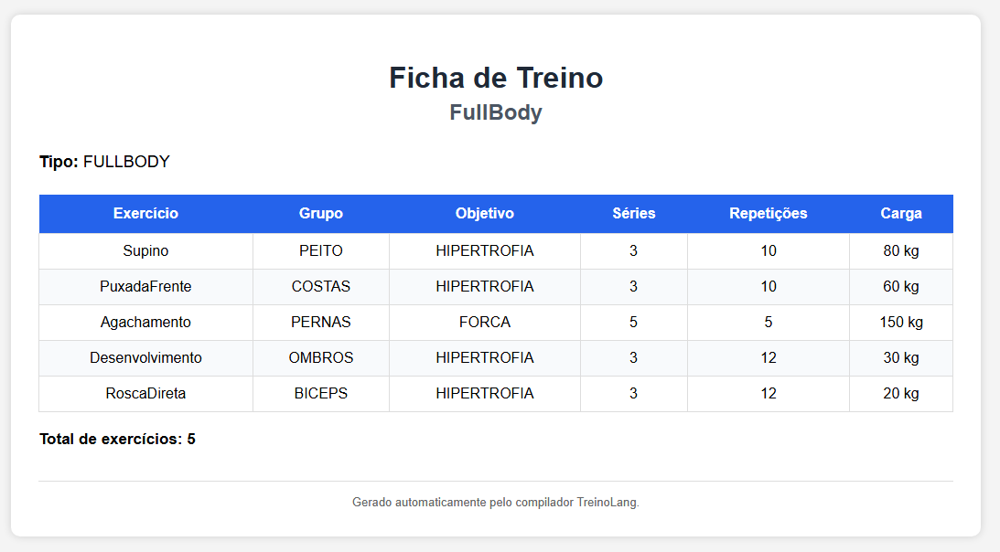

# 🏋️ TreinoLang - Compilador para Descrição de Treinos de Musculação


---

# 📌 Descrição

O **Trabalho 6 (T6)** da disciplina **Construção de Compiladores** consiste no desenvolvimento de um compilador completo para uma **DSL (Domain Specific Language)**.

Neste projeto foi desenvolvida a **TreinoLang**, uma linguagem específica para a descrição de treinos de musculação.

A linguagem permite modelar um treino de forma estruturada, especificando:

- nome do treino;
- tipo do treino;
- exercícios;
- objetivo de cada exercício;
- grupo muscular trabalhado;
- número de séries;
- número de repetições;
- carga utilizada.

Após as etapas de **análise léxica**, **análise sintática** e **análise semântica**, o compilador gera automaticamente uma página **HTML** contendo a ficha completa do treino.

---

# 🎯 Objetivo da Linguagem

A TreinoLang foi criada para facilitar a definição de treinos de musculação utilizando uma linguagem simples, legível e especializada.

Com ela é possível:

- definir treinos completos;
- organizar exercícios por tipo de treino;
- especificar objetivos de treinamento;
- definir séries, repetições e cargas;
- validar automaticamente a consistência do treino;
- gerar automaticamente uma ficha HTML.

---

# 📝 Estrutura da Linguagem

Todo programa em TreinoLang segue a estrutura abaixo.

```text
treino NomeTreino
tipo TIPO

exercicio NomeExercicio {
    objetivo OBJETIVO
    grupo GRUPO
    series INT
    repeticoes INT
    carga INT
}
```

Um treino pode possuir um ou mais exercícios.

---

# 📖 Elementos da Linguagem

## Treino

Declara um treino.

```text
treino PushDay
```

---

## Tipo de treino

Define o tipo do treino.

Valores possíveis:

```text
PUSH
PULL
LEGS
FULLBODY
```

Exemplo:

```text
tipo PUSH
```

---

## Exercício

Declara um exercício pertencente ao treino.

```text
exercicio Supino {
    ...
}
```

---

## Objetivo

Indica o objetivo do exercício.

Valores permitidos:

```text
FORCA
HIPERTROFIA
RESISTENCIA
```

---

## Grupo Muscular

Indica qual grupo muscular é trabalhado.

Valores permitidos:

```text
PEITO
COSTAS
PERNAS
OMBROS
BICEPS
TRICEPS
```

---

## Séries

Quantidade de séries.

```text
series 4
```

---

## Repetições

Quantidade de repetições.

```text
repeticoes 10
```

---

## Carga

Carga utilizada em quilogramas.

```text
carga 80
```

---

# ✅ Exemplo Completo

```text
treino PushDay
tipo PUSH

exercicio Supino {
    objetivo HIPERTROFIA
    grupo PEITO
    series 4
    repeticoes 10
    carga 80
}

exercicio Desenvolvimento {
    objetivo HIPERTROFIA
    grupo OMBROS
    series 3
    repeticoes 12
    carga 30
}

exercicio TricepsPulley {
    objetivo HIPERTROFIA
    grupo TRICEPS
    series 3
    repeticoes 12
    carga 25
}
```

---

# 🔍 Verificações Semânticas

Além das verificações léxicas e sintáticas, o compilador realiza diversas verificações semânticas sobre o programa.

## Exercícios

- detecção de exercícios duplicados;
- verificação de exercícios existentes na base da linguagem;
- compatibilidade entre exercício e grupo muscular;
- compatibilidade entre exercício e objetivo.

---

## Parâmetros

- séries maiores que zero;
- repetições maiores que zero;
- carga maior que zero;
- carga máxima permitida;
- compatibilidade entre objetivo e faixa de repetições.

---

## Treino

- consistência entre o tipo do treino e os grupos musculares utilizados;
- balanceamento do treino conforme o tipo definido;
- validação do volume total do treino.

---

# 🌐 Geração de HTML

Quando nenhuma etapa da compilação encontra erros, o compilador gera automaticamente uma página HTML contendo uma ficha organizada do treino.

O documento apresenta:

- nome do treino;
- tipo do treino;
- tabela contendo:
  - exercício;
  - objetivo;
  - grupo muscular;
  - séries;
  - repetições;
  - carga.

O HTML possui estilização CSS incorporada ao próprio documento, permitindo sua visualização diretamente em qualquer navegador.

---

# 🖼️ Exemplo de Saída HTML

A figura abaixo apresenta um exemplo de ficha de treino gerada automaticamente pelo compilador a partir de um programa válido escrito em TreinoLang.
<p align="center">
  
</p>

---
# ⚙️ Arquitetura do Compilador

O projeto está organizado em componentes independentes.

| Classe | Responsabilidade |
|----------|-----------------|
| `Main` | Inicializa todas as etapas da compilação |
| `TreinoLang.g4` | Define a gramática da linguagem |
| `TreinoLangErrorListener` | Implementa um *Error Listener* personalizado do ANTLR para capturar e formatar mensagens de erro léxicas e sintáticas de maneira padronizada |
| `SemanticAnalyzer` | Implementa todas as verificações semânticas |
| `HTMLGenerator` | Gera automaticamente a ficha HTML |
| `TabelaExercicios` | Base de exercícios conhecidos pela linguagem |
| `ExercicioInfo` | Armazena informações semânticas dos exercícios |
| `GrupoMuscular` | Enum contendo os grupos musculares |
| `Objetivo` | Enum contendo os objetivos de treinamento |

---

# 📁 Organização do Projeto

```text
T6/
├── src/
│
├── main/
│   ├── antlr4/
│   │   └── TreinoLang.g4
│   │
│   └── java/
│       └── br/
│           └── ufscar/
│               └── dc/
│                   └── compiladores/
│                       └── TreinoLang/
│                           ├── Main.java
│                           ├── SemanticAnalyzer.java
│                           ├── HTMLGenerator.java
│                           ├── TabelaExercicios.java
│                           ├── ExercicioInfo.java
│                           ├── GrupoMuscular.java
│                           ├── Objetivo.java
│                           └── TreinoLangErrorListener.java
│
├── casos-de-teste/
│   ├── erros/
│   ├── lexico/
│   ├── sintatico/
│   ├── semantico/
│   └── geracao-html/
│
├── testar.sh
├── pom.xml
└── README.md
```

---

# 📥 Clonando o Projeto

```bash
git clone https://github.com/layssonsantos/T6-Compilador.git
```

Entre na pasta:

```bash
cd T6-Compilador
```

---

# ▶️ Compilando o Compilador

Na raiz do projeto execute:

```bash
mvn clean package
```

Durante a compilação o Maven irá:

- gerar automaticamente o Lexer e Parser do ANTLR;
- compilar todo o projeto;
- executar o processamento da gramática;
- gerar o arquivo executável:

```text
target/t6-1.0-SNAPSHOT-jar-with-dependencies.jar
```

---

# ▶️ Executando o Compilador

Utilize o comando:

```bash
java -jar target/t6-1.0-SNAPSHOT-jar-with-dependencies.jar entrada.tlang saida.html
```

ou

```bash
java -jar target/t6-1.0-SNAPSHOT-jar-with-dependencies.jar entrada.tlang saida.txt
```

Caso existam erros de compilação, o arquivo de saída conterá as mensagens correspondentes.

Caso não existam erros, será gerado automaticamente um documento HTML.

Exemplo:

```bash
java -jar target/t6-1.0-SNAPSHOT-jar-with-dependencies.jar \
casos-de-teste/geracao-html/entrada/html_push_day.tlang \
resultado.html
```

---

# 🧪 Casos de Teste

O projeto possui casos de teste separados por etapa da compilação.

| Pasta | Objetivo |
|--------|----------|
| `lexico` | Testes da análise léxica |
| `sintatico` | Testes da análise sintática |
| `semantico` | Testes das verificações semânticas |
| `geracao-html` | Testes da geração de HTML |
| `erros` | Exemplos demonstrativos de erros léxicos, sintáticos e semânticos |

Cada pasta contém:

```text
entrada/
saida-esperada/
```

---

# ▶️ Executando Todos os Testes

Foi disponibilizado um script para executar automaticamente todos os testes do projeto.

Basta executar:

```bash
chmod +x testar.sh
./testar.sh
```

O script:

- recompila o projeto;
- executa todos os casos de teste;
- compara automaticamente a saída obtida com a saída esperada;
- apresenta um resumo final indicando quantos testes passaram e falharam.

---

# 🔧 Modificando a Linguagem

Caso seja necessário alterar a gramática (`TreinoLang.g4`), basta recompilar o projeto:

```bash
mvn clean package
```

O plugin do ANTLR irá regenerar automaticamente:

- Lexer;
- Parser;
- Visitor;
- BaseVisitor.

Não é necessário executar comandos adicionais.

---

# 📚 Documentação do Código

Todo o projeto foi organizado de forma modular.

As responsabilidades encontram-se separadas em classes específicas para:

- análise semântica;
- geração de HTML;
- representação dos exercícios;
- tabela de exercícios conhecidos;
- enums utilizados pela linguagem.

A gramática da linguagem encontra-se no arquivo:

```text
src/main/antlr4/TreinoLang.g4
```

---

# 🛠 Tecnologias Utilizadas

- Java 11
- Maven
- ANTLR4
- HTML5
- CSS3

---

# 👨‍💻 Autor

**Laysson Santos da Silva**

Universidade Federal de São Carlos (UFSCar)

Departamento de Computação

Disciplina de Construção de Compiladores